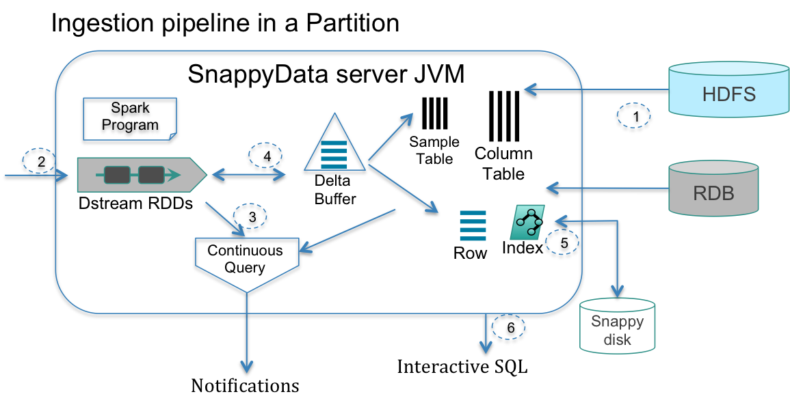

## Data Ingestion Pipeline
The data pipeline involving analytics while streams are being ingested and subsequent interactive analytics will be the pervasive architecture for real-time applications. The steps to support these tasks are depicted in the following figure and explained below.

1. Once the SnappyData cluster is started and before any live streams can be processed, ensure that the historical and reference datasets are readily accessible. The data sets may come from HDFS, enterprise relational databases (RDB), or disks managed by SnappyData. Immutable batch sources (for example, HDFS) can be loaded in parallel into a columnar format table with or without compression. Reference data that is often mutating can be managed as row tables.

1. Spark Streaming’s parallel receivers are relied on to consume data from multiple sources. These receivers produce a DStream, whereby the input is batched over small time intervals and emitted as a stream of RDDs. This batched data is typically transformed, enriched and emitted as one or more additional streams. The raw incoming stream may be persisted into HDFS for batch analytics.

2. Next, SQL is used to analyze these streams. As DStreams (RDDs) use the same processing and data model as data stored in tables (DataFrames), these data structures are seamlessly combined in arbitrary SQL queries (referred to as continuous queries as they execute each time the stream emits a batch). When faced with complex analytics or high-velocity streams, SnappyData can still provide answers in real time by resorting to approximation.

3. The stream processing layer can interact with the storage layer in a variety of ways. The enriched stream can be efficiently stored in a column table. The results of continuous queries may result in several point updates in the store (for example, maintaining counters). The continuous queries may join, correlate, and aggregate with other streams, history or reference data tables. When records are written into column tables one (or a small batch) at a time, data goes through stages, arriving first into a delta row buffer that is capable of high write rates, and then aging into a columnar form. Our query sub-system (which extends Spark’s Catalyst optimizer) merges the delta row buffer during query execution.

4. To prevent running out of memory, tables can be configured to evict or overflow to disk using an LRU strategy. For instance, an application may ingest all data into HDFS while preserving the last day’s worth of data in memory.

5. Once ingested, the data is readily available for interactive analytics using SQL. Similar to stream analytics, SnappyData can again use Synopsis Data Engine to ensure interactive analytics on massive historical data in accordance with users’ requested accuracy.
